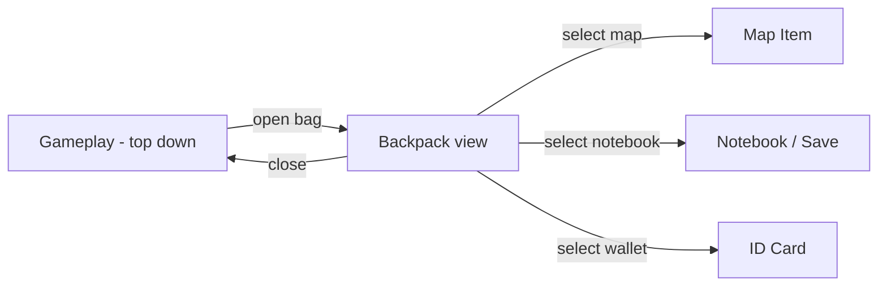
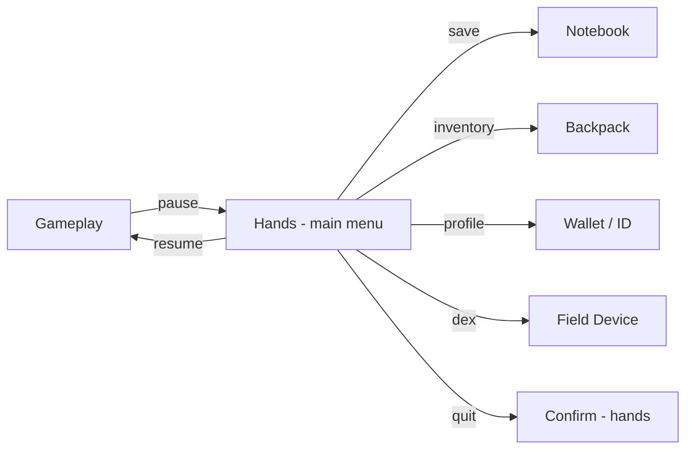
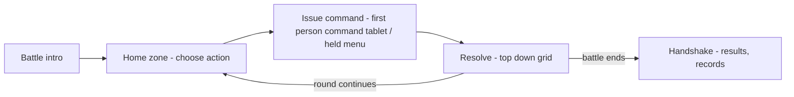

# Phylaworld — Game Design Document (GDD)

> **Purpose:** The creative **design bible** of Phylaworld. Where the [PRD](./PRD.md) states *product* intent (what/why), [ARCHITECTURE.md](./ARCHITECTURE.md) states *technical* how, [TRD.md](./TRD.md) states *behavioral* contracts, and [DATA_SCHEMA.md](./DATA_SCHEMA.md) states *data* truth, this document is the **authority on the experience**: story, world lore, tone, game feel, identity, art/music direction, UI/UX philosophy, and player emotional design.
> **Doc role:** The GDD **references** the mechanical/technical contracts rather than restating them. When creative intent conflicts with a product requirement, the **GDD wins on *experience* intent**; the **PRD wins on *product* intent**; the technical docs govern *how* the experience is delivered.
> **Doc status:** Living document. Sections marked **[OPEN]** are unfinished or pending decisions and are flagged for review. The creature term (for the species) is a **[PENDING] pick** — see §3.

---

## Table of Contents
1. [Identity & Design Pillars](#1-identity--design-pillars)
2. [Core Fantasy: The Survival-Isekai Lens](#2-core-fantasy-the-survival-isekai-lens)
3. [The Creature Term & Foundational Lore](#3-the-creature-term--foundational-lore)
4. [The World & Mainline Story](#4-the-world--mainline-story)
5. [The Type Chart — Scientific Logic](#5-the-type-chart--scientific-logic)
6. [Systems in Design Terms](#6-systems-in-design-terms)
7. [Battle & Tactics Design](#7-battle--tactics-design)
8. [Progression & Long-Horizon Meta](#8-progression--long-horizon-meta)
9. [Diegetic UI/UX](#9-diegetic-uiux)
10. [Economy & Monetization — Free-to-Play / External](#10-economy--monetization--free-to-play--external)
11. [Art, Sound & Music Direction](#11-art-sound--music-direction)
12. [Accessibility & Difficulty](#12-accessibility--difficulty)
13. [Content Roadmap & Post-Launch](#13-content-roadmap--post-launch)
14. [Technical Appendix — Systems Index](#14-technical-appendix--systems-index)
15. [Open Design Questions & Risks](#15-open-design-questions--risks)

---

## 1. Identity & Design Pillars

### 1.1 One-line identity

> **Phylaworld is a community-first, mod-friendly, *survival-Isekai* creature world** where you are an ordinary person dropped into a living wild planet — you tame, study, train, ride, and breed unique individuals, reshape the world's details, automate your own bases — and every creature you befriend is a persistent, portable identity that travels with you beyond the game itself.

The three words that matter in that sentence are **ordinary person**, **living wild planet**, and **portable identity**. Everything in this document descends from those.

### 1.2 What this game is, and is not

| It IS | It is NOT |
|---|---|
| A survival-Isekai adventure: you *arrive*, frightened and under-equipped, and must learn to live | A power fantasy where you are a born trainer with a rented outpost |
| A game where creatures are *individuals*: unique DNA, histories, bonds, deaths | A game where creatures are interchangeable stat-blocks |
| Deep tactical grid battles where position, hazards, and bond matter as much as type | A menu-driven rock-paper-scissors type match |
| A *sandbox* within designated places: you reshape details, never fundamentals | A freeform terraforming god-game |
| A game whose world *feels alive*: ecology, weather, physics, chemistry, cause-and-effect | A static theme-park of spawn points |
| Radical moddability: anyone adds content with text files and a zip | A closed, editor-gated content pipeline |
| **Free-to-play**, earn-everything, money made *outside* the game | A live-service gacha with in-game purchases |
| A *diegetic* UI: every menu is an object you hold in your character's hand | A floating HUD chrome hovering over the world |

### 1.3 Experience pillars

The PRD's pillars are product words (see PRD §intro). Here are the **player-experience** reframes — what the player should feel:

1. **Collection** — the joy of a *particular* creature: its variant, its scars, its records, its bond. Not "a fire type" but *Cinder, the alpha Emberling that fell down a hole and lived*.
2. **Tactical drama** — grid battles where a well-placed reposition, a terrain hazard, and your creature's *trust* in you can turn a losing fight around.
3. **Discovery & survival** — the fear and wonder of arriving in a wild place you do not understand, and slowly coming to know it.
4. **Sandbox mastery** — the satisfaction of turning a chaotic wild corner into a small, working, *yours* farm-and-craft homestead.
5. **Community** — trading candidates, sharing discoveries, competing on battle records, and building in shared worlds without griefing.
6. **Mod-first expression** — the game is a canvas; players and modders make it theirs, and everyone else benefits.

### 1.4 The two-perspective contrast (a foundational choice)

Phylaworld deliberately splits into **two visual/emotional registers**:

- **The world** is top-down, small-in-your-hands, distant — the vastness of a place bigger than you.
- **The player's "shell"** (menus, inventory, saves, map, ID) is **first person and diegetic** — close-in, intimate, *your hands holding your own things* (§9).

This is not decoration. It is the mechanical backbone of the survival-Isekai fantasy: you are small in a big world, but the things *you carry* are yours, up close, and personal. Every time the player opens a menu, we shift them from "god over the map" to "person on the ground." That shift is the emotional signature of the game.

---

## 2. Core Fantasy: The Survival-Isekai Lens

### 2.1 The emotional promise

You are not a Pokémon protagonist given a starter by a friendly professor. You are a person who, one unremarkable morning, **falls out of your ordinary life into a world that was never designed for you** — and you have to survive it. You have no professor, no Pokédex pre-loaded with every species, no lab coat. You have the clothes on your back (whatever those are), a notebook, a backpack, a wallet with your ID — and the terrifying, wonderful task of meeting the native life on its own terms.

Everything emerges from that:

- **Taming** is earned trust, not a convenience (PRD F4 / ARCH §10.2).
- **Research/dex** is observation, not auto-fill — because you *don't know* the world yet (PRD F6, FR-D1.1).
- **Danger is real**: creatures can hurt you, and scarcity/weather/terrain matter (PRD FR-C1.8 death, FR-B1.4 hazards).
- **Your kit matters**: what you happened to have in your pockets shapes how you can act (§4, the Prismatic Fall).

### 2.2 Game-feel spec

"Game feel" is the physical, moment-to-moment *texture* of playing. For each core loop, we define the target feeling and the levers that produce it.

| Loop | Target feeling | Feel levers |
|---|---|---|
| **Taming** | Tens, then relief. A patient approach that could go wrong at any second. | Slow approach animations, escalating heartbeat/ambient, a trust meter that creeps up and can drop on a mistake, the creature slowly leaning in — then a warm, low confirmation chord on success. |
| **First survival scramble** (opening) | Panic with a way out. Pressure, but never unfair. | The chaos is *visible* (creatures moving erratically, debris), safe pockets are signposted, the player always has a defensible route. |
| **Gathering / harvesting** | Rhythmic, satisfying. | Audio "thock" on each chop/mine, particles, a small pop as resources enter the bag, no empty-feeling downtime. |
| **Battles** | Tactical tension. Each decision has weight. | Clear telegraphing of ranges/areas, screen-space feedback per hit, the friendly-fire chance *shown* on the target before committing. |
| **Base building / automating** | Mastery and pride. | Snapping feedback, the "it's working, it's mine" satisfaction of watching a creature autonomously produce, cozy ambient bed-tone. |
| **Breeding** | Curiosity and payoff | A lineage view that makes the creature's ancestry *feel* real; reveal of the offspring's variant is a moment. |

Concrete feel targets (measurable):
- **Input latency:** world movement < ~60ms perception; button presses respond same-frame where possible.
- **Feedback density:** every consequential action produces ≥2 of {sound, particle, screen shake, haptic, text}.
- **Tension pacing:** no more than ~20s of unbroken, unresolved survival pressure in the opening before a relief beat.
- **Readability:** a threat the player cannot see coming fails the design. Danger must be telegraphed *diegetically* (cracked ground, alarmed creatures, shaking) before it resolves.

These are aspirations the TRD / implementation must honor; where they harden into requirements they are referenced from [TRD.md](./TRD.md).

---

## 3. The Creature Term & Foundational Lore

> **Why this section exists first.** The *name* for the creatures ("Pokémoón", "Pals", "Digimon") and their *origin* are the two most-reused, most-habit-forming words in the entire franchise. Establishing them early — but *loosely* — prevents a thousand future contradictions. Per [ARCHITECTURE](./ARCHITECTURE.md) design law 3, stable names are load-bearing; we want to settle the *public, in-world* term once, while keeping the *truth* flexible.

### 3.1 The generic creature term **[PENDING]**

We need a single colloquial word — the player-facing noun — for a native lifeform. The game is **Phylaworld**, so term candidates that derive from **`phyla`** (the plural of *phylum*, a primary branch of the tree of life) are strongly on-theme: these creatures *are* the branches of this world's tree of life.

Candidates:

| Term | Base | Pros | Cons |
|---|---|---|---|
| **Phylla** | *phylum* | On-theme, short, scientific-plural ring | Sounds close to "phylum" but unusual as a noun; ambiguous with taxonomy, which the game already uses differently (ARCH §5.2) |
| **Phylon** (pl. **Phylons**) | *phylum* | **Recommended.** Clean, evocative, symmetric with "Pokémoón/Pals." Reads as a distinct creature noun; "a Phylon / two Phylons" is natural. | Mild clash with "phylum"/taxonomy in docs — easy to disambiguate (taxonomy = breeding class; Phylon = the creature) |
| **Phylite** (pl. **Phylites**) | *phylum* + *-ite* | Scholarly/geological ring (quartzite, meteorite) — good if we want them to feel *formed/fallen* | "-ite" hints at mineral; could mislead toward crystalline biology |
| **Wanderer** (pl. **Wanderers**) | — | Warm, fits the survival-Isekai *awning migration* feel; universal | Generic; overlaps with a common word for travelers/NPCs; weak genre identity |
| **Liminal** (pl. **Liminals**) | *limen* (threshold) | Precisely evokes "creatures on the threshold of worlds" — strong for the Prismatic-Fall premise | Cold/clinical; poor for a cute creature game; hard for kids |
| **Drifter** | — | Fits the "drifted into form" genesis myth (see §3.2) | Same genericity problem as Wanderer |
| **Emberling**-style coinage (e.g. **Silhoutte**, **Vagrant**) | — | Unique | Hard to make one word that carries *all* creature kinds |

**Recommendation: `Phylon` (plural `Phylons`).** It is on-theme with the franchise name, feels like a creature noun, and pairs perfectly with the genesis myth ("the world's many phyla became Phylons"). Until final pick, this document uses **Phylon(s)** provisionally.

> **Naming-law note:** The *colloquial* term ("a Phylon") is an in-world framing word, **not** a `modid` identifier, so [ARCHITECTURE](./ARCHITECTURE.md) law 3 (stable full IDs) does not bind it — content ids stay `"modid:species_id"` regardless. However, because the public term will appear in marketing, UI copy, and every mod's text, we settle it once and keep it. Final pick is a **[PENDING]` decision in §15.**

### 3.2 Genesis myth — in-world, loose canon

**Framing decision [LOCKED]:** The origin of Phylons is presented **as an in-world belief, not canonical fact.** There is no single true origin nailed down in v1. Different regions, cultures, and even individual Phylons "remember" different stories. This maximizes future leg-room: the real origin can be revealed or reworked later, and mods can add their own regional creation myths without contradicting canon.

Three recurring myths (regional variants — you can pick/remix/rename, and mods can add more):

- **The Prismatic Rains (the dominant myth).** Long ago, the sky *broke* and rained **prism-stained water** onto a sleeping world. Where each drop landed and pooled, the water took *shape* — becoming the first Phylons, each bearing a sliver of the color it drank. This directly prefigures the **Prismatic Fall** opening (§4): players arrive the same way the first life did. The myth is popular precisely *because* it rhymes with how newcomers themselves arrive.
- **The Drift into Form.** Phylons did not begin as bodies at all. They were *elsewhere* — a formless, connected sea of being — and slowly **drifted**, fragment by fragment, into separate, deliberate, breathing shapes. Old Phylons are said to be "thinner" than young ones, closer still to that original water. This supports the "aging beats transformation" ideal (PRD FR-C1.7 / ARCH §7): Phylons *become more themselves*, not something else.
- **The Deep Mothers (a minority belief).** Certain great, ancient, mostly-submerged Phylons ("the Mothers") are said to *dream* new Phylons into existence along the world's rivers and roots. It is treated as folklore, but it neatly rationalizes why Phylons cluster near water and why their lineages carry so much weight (breeding via taxonomies, PRD F8).

**What is deliberately left open (canon gaps):** Whether the world Phylaworld is a planet, a pocket-dimension, a dream, or a fallen kingdom of the *player's own* Earth; whether humans existed here before; whether there is a "true" single origin at all. **None of these are answered in v1.** Each is a design lever for post-launch content or mods.

### 3.3 Ecology examples

To keep species design tonally and ecologically consistent *without* hard-restricting, we establish a short set of **starter-case-study species**. These are canonical examples of "how a Phylon fits its world." Future species should feel they could share a biome with these.

> These are **draft design illustrations**. Exact stats/moves/learnset live in the data (`species/*.json`); this section is the *ecological personality* the data should express.

**A. The Emberling** *(fire / air starter candidate)*
- **Habitat:** scrubland, volcanic fringe, sun-baked uplands. Active at dawn and dusk.
- **Diet:** dry grasses, wind-blown seeds, mineral salts; licks ember-warm rocks to "season."
- **Behavior:** extremely curious and social; follows moving objects that don't threaten it — which is why a frightened, running human so easily becomes its first friend.
- **Role in biome:** fire-scar rebirther — its sparks clear dead brush and enrich soil, making room for the grasses it eats; a small keystone.
- **Lifecycle (echoes ARCH §7 growth):** like all Phylons, its growth is *wholeness* not *replacement* — an Emberling grows larger, brighter dorsal embers, and a steadyer stride; it never becomes a "cinder form."
- **Why a good starter:** forgiving (it approaches you), teaches the fire/air/plant loop, and its ecology (fire renewing brush) is a gentle first lesson that the world is a *system*, not spawn points.

**B. The Muddlefin** *(water starter candidate)*
- **Habitat:** slow rivers, reedy ponds, seasonal wetlands.
- **Diet:** algae, detritus, insect larvae; filter-feeds on the current.
- **Behavior:** calm and tactile; herds its young through shallows, and will "offer" a fallen leaf as an introduction.
- **Role in biome:** water-purifier and seed-mover — it carries seeds between pools, literally planting the world (a foreshadow of the plant type and of the player's own planting, FR-SV1.2).
- **Why a good starter:** teaches water's *abundance* and transport (FR-PH1.2) — and it is the most likely starter to later *ride* across rivers.

**C. The Ridgeback Pup** *(earth/martial starter candidate)*
- **Habitat:** rocky foothills, scree slopes, cave mouths.
- **Diet:** roots, tubers, the occasional beetle; excavates with its ridge-plates.
- **Behavior:** territorial but loyal once trusted; will "arm-wrestle" with rocks.
- **Role in biome:** soil-turner; its scratch-mounds aerate earth and bury seeds. A geologic analogue to the Emberling's fire.
- **Why a good starter:** teaches sturdy defense, martial scarcity, and that *earth itself* is a character in this world.

**D. Two hidden starters (exploration rewards)** — see §4.7. Their ecologies are deliberately *stranger* (e.g. a crystal-lifeform that photosynthesizes along mineral seams, and a plant-fungus symbiote that "dreams" the underground). They exist to reward the player who stops, looks, and investigates instead of heading straight for the obvious three.

> **Lore-consistency rule (a GDD pillar):** Every species must be able to answer three questions about itself: *where does it live, what does it eat, and what does it do for its environment?* If a species can't answer at least two, it doesn't get designed. This keeps the world ecologically *believable* and gives modders a ready-made house-style checklist.

---

## 4. The World & Mainline Story

### 4.1 World bible & tone

**Setting:** *Phylaworld* — a lived-in, wild, hand-touched planet (its exact ontology is an open canon gap, §3.2). It is not a pristine theme-park: it has weather, erosion, rutted trails, abandoned waystations, and the sense that *something* fell here before and left traces the player will learn to read.

**Tone:** warm-survival. It takes the *danger* honestly (you could die, your creature could die) but threads it through discoverable joy. Think *a wistful naturalist's field journal*, not grimdark. There is humor in a creature being curious about your umbrella; there is gravity in a creature trusting you past its fear.

**The connected-creature-universe framing (PRD F14 / FR-CG1):** Phylaworld is the *mainline* game of a franchise. A Phylon's DNA is a persistent, portable identity: it can travel to other titles, and return trips unlock features. The GDD treats the world as one **node** in a larger (as-yet unspecified) across-games reality — which is another reason the single-world origin myth is left loose.

### 4.2 Region design principles

- **Every region teaches one lesson** the player carries forward (a closed difficulty/onboarding mirror, see §8.4).
- **Every region has a top, a bottom (underground, PRD FR-X1.3), a ride-accessible path, and at least one hidden starter signpost** (§4.7).
- **Climate/terrain are data ("NG6": deserts stay deserts, ARCH §1 / PRD NG6); the *details* are mutable** (FR-SV1.1).
- **Palette + music set the region's emotional key** (see §11); the region's myth variant (one of §3.2) colors its NPC dialogue.

[DRAFT] Starter regions (names provisional, palettes/mood in §11):

1. **Ashwater Pools** *(tutorial / temperate wetlands)* — teaches: movement, gathering, the notebook, first tame, first ride. The Prismatic Fall drops you here. Muddlefin signs.
2. **Cindergrass Reach** *(dry upland scrub)* — teaches: fire/air/plant loops, fire-scare of survival, a first "danger" zone. Emberling homes. Opens the forging chain.
3. **Stonebram Indian Hills** *(rocky foothills)* — teaches: martial/earth defense, the underground, bases & claiming (FR-BA1.1–1.4). Ridgeback habitat. First designated base zone.

> [OPEN] Additional regions, their path/ride/underground connectivity, and their associated myth variants are **[OPEN]** and will be detailed as the roadmap (§13) progresses.

### 4.3 The mainline story — full outline (canonical v1)

The story is deliberately **player-driven-then-guided**: the *why* of arrival is a loose thread; the *how to survive and belong* is the structured arc.

**Act 0 — The Prismatic Fall** (the opening; canonical for all players, §4.4–4.7)
- You are an ordinary person from an ordinary life. Through an opening on the main menu, you *begin* — the key art of a detailed figure stands against a sky that cracks and rains **prism color**.
- An abstract, formless creature ("the Prism-Guide") gently quizzes you (§4.5) — preferences that quietly become your character and your landing zone.
- You **morph**: the detailed key-art figure unspools into the small, top-down sprite that will carry you — inside a **rainbow bubble**, falling from the sky to Ashwater Pools (§4.6).
- Impact. Chaos. Survival (§4.7).

**Act 1 — Stranger in the Pools** *(tutorial→first tame)*
- You wake among startled wilds. Creatures displaced and alarmed by your fall mill about; you must not panic them, must not get hurt.
- You gather your **starter kit** (wallet, notebook, bag, the ≥2 odds-and-ends you happened to have) and orient.
- You find one of the **three easy starters** (§4.7) and earn its trust — your first Phylon. The bond forms; the notebook's first page is written.
- A local dweller (the **mentor** — provisional "Warden Ione", a weathered field-guide who has seen "sky-fallen folk" before) takes you in, teaches you the notebook, the bag, the dex, and points to the first tower.

**Act 2 — Learning the Land** *(first battles, research, riding)*
- The mentor tasks you with *understanding* the Pools: observe behaviors with the dex (FR-D1.1), gather resources, mediate a few displaced-creature disputes (teaches the tactical grid §7).
- You craft a **rideable starter route**, then ride for the first time (FR-R1.1–1.4).
- You reach your first **Tower** (FR-S1.2): storage, breeding lab, ball-skin customization, and — with your ID wallet — proof you *are* someone, anchored.

**Act 3 — The Cindergrass Wake** *(danger, forging, first base)*
- A dry-season "wake" of displaced life pushes north; the fire-food loop is destabilizing a scrubland. You travel to Cindergrass Reach to learn why.
- You earn a **claim item** and **regional permission**, then claim your first **base zone** (FR-BA1.2): the sandbox settles in — farm a small plot, run a crafting station with a worker creature (FR-BA1.5–1.7).
- The story asks a hard question (mirroring death/permadeath honesty, PRD FR-C1.8): *what are you willing to risk, and for whom?* A creature is put in genuine peril; your bond and your choices decide the outcome.

**Act 4 — The Deep & the Stonebram Hills** *(underground, research payoff)*
- A lead says the answer to the "wake" lies *below*: the **underground** (FR-X1.3) of the Stonebram Hills.
- Deep exploration, mineral/resource nodes, hidden spaces, a few secrets of the world's *drift*.
- Research (dex) from across three acts **reciprocates into new options**: a rare move, a breeding line, an artificial-creation path — the long-horizon meta (PRD F6/F8) starts paying dividends.
- A hidden-starter truth is uncovered: these rarer Phylons were *already here*, watching the sky-fallers — hinting the myth and the arrival are linked (§3.2).

**Act 5 — The First Sky (endgame seed)**
- The mentor's oldest secret: the tower network was built to *watch the sky* — because sky-falls are not new.
- The player must decide how a newcomer *settles*: the endgame opens into **regional/global challenges** (FR-M1.4), **post-game research/breeding**, and the **cross-game DNA bridge** is teased (FR-CG1).
- Full victory is left *open* (multiplayer, seasons, mods add beyond Act 5). The single-player "ending" is a **threshold**: you have, against the odds, *belonged*.

### 4.4 Act 0 detail — the Prismatic Fall (canonical opening)

This is the player's first minute. Design it as a tight, emotional, *playable* moment:

1. **Main menu → "Begin."** A muted title screen over the Prismatic sky key-art.
2. **Intro (flash, ~30s).** The key-art figure stands on an ordinary street; the sky cracks; prism rain begins. (Purpose: instant, emotional worldset — "this is your ordinary life, and it's about to break.")
3. **The Quiz (§4.5).** An abstract Prism-Guide asks a handful of preference questions. No wrong answers; each quietly seeds your character, gear, and landing zone.
4. **The Morph.** The detailed figure unspools into the **top-down sprite**, wrapped in a **rainbow bubble**, tumbling down through prism-lit clouds toward the ground.
5. **The Fall.** A controlled, cinematic sky-drop — not stressful, *wondrous* — ending in an impact that drops the *player-character* on Ashwater Pools.
6. **The Awareness.** Wake. Your ID wallet beeps for the first time. The world is *alive and alarmed*. → hands you the controls.

### 4.5 The Quiz (character creation, diegetic)

**Framing:** The Prism-Guide — an abstract, rainbow, roughly-creature-shaped presence — asks you things in a tone of wonder, *as if it is choosing the right shape for you to wear*. It never uses the words "this is your hair color" — it asks what *feels* like you.

Questions (shown to the player as gentle preference prompts; each silently maps to data):

- **"What color is your light?"** → avatar base palette (skin/hair/eye tones bundled tastefully).
- **"Where do you feel most yourself?"** → *spawn region + starter-kit weather relevant* (wetland / upland / foothill → also adjusts the starter offer, §4.7).
- **"What did you carry that morning?"** (multi-select "at least 2") → the **starter-kit odds-and-ends** (§4.7).
- **"What do you look like?"** → the morph's appearance (hair/eyes/build) — the diegetic way of saying "character creation."
- **"Who do you hope to become?"** → a soft first whisper into **quest seeds** and a suggested-playstyle hint (battle / explore / build) that flavors early quest *ordering*, not content access.

Design rules:
- **No wrong answers, no trap options, all options are valid and fun.**
- **Zero meters/sliders in the diegetic fiction** — preference prompts only; the choices map to an avatar *preset* the player can later fine-tune in the bag/mirror (this is the one place we allow a non-diegetic fine-tune screen, clearly framed as "adjust your look").
- The quiz **must not feel like a job interview** — it is a conversation with a curious creature, ≤60 seconds, skippable-in-whole with sensible defaults, always re-answerable.

### 4.6 The starter kit (semi-random, guaranteed contents)

The kit you arrive with is the *material embodiment* of "ordinary person from ordinary life." Guaranteed contents:

| Item | Purpose (diegetic) | Purpose (gameplay) | Data slot |
|---|---|---|---|
| **Current clothes** | what you wore | avatar appearance seed | `appearance` |
| **A notebook + pencil** *(may be randomized among a few variants)* | the save menu / journal | save + journal + dex scratch | `notebook` |
| **A backpack** *(may be randomized)* | the inventory menu | inventory + carrying capacity | `bag` |
| **A wallet / ID card** | holds a photo, personal data, achievements | player profile, achievements, quest ledger | `wallet` |
| **≥2 random "real-world" odds-and-ends** | things people actually carry | utility seeds for the opening | `starter_odds` |

**Odds-and-ends pool** (the "≥2 random real-world objects" — you can expand; at least 2 always granted):
water bottle · pocket-knife · umbrella · makeup kit · flashlight · a paper map of *somewhere else* (unreadable here — a nice lore beat) · car keys (of a car that is not here) · a book you were reading · spare socks · a phone with a dead battery (its screen becomes a decorative/backstory item) · a wallet-sized photo · a coin or two of the old currency · a crumpled receipt · a comb · a scarf.

Design intent: each object is a *tiny story* and a *possible tool*. The umbrella shelters from heat/rain; the pocket-knife is the first "tool-tier" cutting edge (FR-CR1.1); the flashlight helps the underground later; the photo warms a creature's trust. None are required for survival — they're texture *and* leverage. They also guarantee every player's opening differs, which fuels the survival-Isekai "what did *I* bring" feeling.

### 4.7 The starter event — three easy, two hidden

After the fall, "when searching for their first creature to bond with":

- **The three easy starters** — present, curious, approachable: **Emberling, Muddlefin, Ridgeback Pup** (the §3.3 triad). Thematically a **three-way stalemate** (each has an affinity/appetite; none is strictly "better"). They are found by *wandering the safe pockets* and doing a gentle trust interaction. Exactly the classic three-starter feel — but each is a *wild individual you persuaded*, not a handout.
- **The two hidden starters** — much harder to find, rewarding a player who **stops, looks, and investigates** (like the hidden-Pikachu-in-GO design you cited). [DRAFT, [OPEN] final design]:
  - **The Crystalbright** — hidden in a mineral seam of the fall-crater; only appears if you examine the oddly luminous rubble with your flashlight.
  - **The Rootmote** — a plant-fungus symbiote that "dreams" the shallows; only surfaces if you sit still near the reeds for a while and *observe* instead of grab.
  - Both are *stranger* Phylons (a deliberate "you found something nobody asked you to find" reward) and pair with the deeper lore (§3.2, the hidden-starter truth in Act 4).
  - **AC:** a player who explores thoroughly in the opening can begin with a hidden starter; no player is *punished* for picking a main three (the hidden ones also recur later as rare wilds, so nothing is missable forever).

### 4.8 Quest-data mapping

Every narrative beat above hooks into the **data-driven quest ledger** so mods can add, retune, or re-order content. See [DATA_SCHEMA.md](./DATA_SCHEMA.md) §3.20 (quests) and [TRD.md](./TRD.md) TR-40..44.

| Story beat | Quest `kind` | Objective types used |
|---|---|---|
| Tutoring note, first tame | `tutorial` / `main` | `tame_creature`, `observe_behavior` |
| Craft notebook/gear | `main` / `side` | `craft_item` |
| Ride first route | `main` | `ride_distance` |
| Claim first base | `main` | `gather`, `build`, `craft_item` |
| Reach a tower | `main` | `build`, `visit_landmark` (extensible) |
| Warden's research asks | `side` | `observe_behavior`, `gather` |
| Underground dive | `main` | `gather`, `tame_creature` |
| Regional/global challenges (endgame) | `event` / `daily` | `battle_win`, `tame_creature`, `collect_species` |

---

## 5. The Type Chart — Scientific Logic

> **Imperative (product decision):** the type chart must have **scientific sense/logic** — physics/chemistry/material-science justification rooted in the real world — *not* Pokémon-style "because we said so." Per your **physics-inspired hybrid** choice: matchups follow real science *where it holds*; where pure science would break the chart's fun/symmetry/balance, game-design judgment wins, and the rationale is documented as an exception.

### 5.1 The 15 types (fixed — ARCH §5.1)

`earth, fire, water, metal, crystal, air, electricity, light, dark, poison, martial, spirit, psionic, plant, neutral`

### 5.2 How to read this chart

`Attack type → Defense type`; values are **effectiveness multipliers** in the data (`type_chart.json`, ARCH §5.1 / DATA_SCHEMA §3.1). 2 = super-effective, 1 = neutral, 0.5 = resisted, 0 = immune.

We justify with **three scientific lenses**: (1) **physics** (energy, conduction, state, momentum), (2) **chemistry/materials** (reactivity, structure, metabolism), (3) for the *conceptual* types (light, dark, spirit, psionic) a **sensory/energetic rationale** grounded in how light, information, and energy actually behave.

### 5.3 The effectiveness matrix (draft — **[REVIEW]** before locking)

> Legend: `2` strong · `1` neutral · `½` resisted · `0` immune. Read "row type attacks column type."

```
ATTACK\DEF →  EAR  FIR  WAT  MET  CRY  AIR  ELE  LGT  DAR  POI  MAR  SPI  PSI  PLA  NEU
EARTH        (½)  2    1    1    1    1    1    1    1    1    1    1    1    1    1
FIRE            1   (½)  ½    2    2    1    1    1    1   (½)   1    1    1    2    1
WATER           1    2   (½)   1    1    1    2    1    1    1    1    1    1    1    1
METAL          2    2    1   (½)   2    1    1    1    1    1    2    1    1    1    1
CRYSTAL        1    1    1    1   (½)   1    1    2    1    1    1    1    2    1    1
AIR            1    2    1    1    1   (½)   2    1    1    1    1    1    1    1    1
ELECTRICITY    2    1    2    1    1    1   (½)   1    1    1    1    1    2    1    1
LIGHT          1    1    1    1    2    1    1    1   (½)   1    1    1    2    1    1
DARK           1    1    1    1    1    1    1    2   (½)   1    1    2    1    1    1
POISON         1    1    1    1    ½    1    1    1    1   (½)   1    1    1    2    1
MARTIAL        2    1    1    2    1    1    1    1    1    1   (½)   1    ½   1    1
SPIRIT         1    1    1    1    1    1    1    1    2    1    2   (½)   2    1    1
PSIONIC        1    1    1    1    1    1    ½    2    1    1    2    1   (½)   1    1
PLANT          2    ½    2    1    1    1    1    1    1    1    1    1    1   (½)   1
NEUTRAL        1    1    1    1    1    1    1    1    1    1    1    1    1    1    1
```

> **This matrix is a first draft for your review.** It is internally consistent against the rationale below, but the *balance* (which cells are 2s vs 0.5s) is tunable in `balance.json` before lock. See §5.4 for every non-obvious cell's scientific rationale, and §5.5 for the deliberate game-design exceptions.

### 5.4 Scientific rationale, cell by cell

The rationale is organized **by type**, each read twice — once as an attacker, once as a defender — straight from the §5.3 matrix. Every number matches the matrix exactly. Cells marked `[EXC]` are deliberate game-design overrides documented in §5.5; everything else is physics/chemistry/material-science-rooted.

Reading convention (consistent for every type):
- **Attacks for 2 (strong vs):** the defenders this type hits hard.
- **Attacks for ½ (dulled):** the defenders that blunt this type's attacks.
- **Takes half from (resists):** the attackers that can only chip at this type.
- **Weak to (takes 2 from):** the attackers that carve through this type.

---

**Earth — the resistant, inertial type.** *Earthy creatures are sluggish but brutal; their strength is that they ignore most attacks, their weakness that the few that land are bone-crushing.*
- **Attacks for 2 (strong vs):** FIRE (fire bakes/clays/calcines earthen structure — thermal chemistry).
- **Attacks for ½ (dulled):** EARTH (rock-on-rock is attrition; earth does not cleave earth).
- **Takes half from (resists):** EARTH (see above).
- **Weak to (takes 2 from):** FIRE, METAL (dense tools shear rock), ELECTRICITY `[EXC]` (the grounding intuition, §5.5), MARTIAL (impact cracks brittle structures), PLANT (roots fracture rock / erode soil).
- Earth is *immunity-free but selective*: it brushes off a huge swath of the chart and only truly fears fire, metal, electricity, kinetic impact, and rooted growth.

**Fire — the exothermic type.** *Energy transfer and oxidation; it burns its own fuel and is governed by the air it needs and the water that quenches it.*
- **Attacks for 2 (strong vs):** METAL `[EXC]` (canon: heat softens metal defense — ARCH law 11), CRYSTAL (thermal shock shatters crystalline solids by differential expansion), PLANT (combustion).
- **Attacks for ½ (dulled):** WATER `[EXC]` (the reciprocal of the legible dominate, §5.5), POISON (heat denatures many toxins; pyro-tolerant biology metabolizes detox), FIRE.
- **Takes half from (resists):** PLANT (moist tissue is snuffed by heat), FIRE.
- **Weak to (takes 2 from):** EARTH (baking/clay), WATER `[EXC]` (the intuitive dominate, §5.5), METAL `[EXC]` (dense material smothers/stifles), AIR (wind feeds and spreads flame with oxygen/convection).
- Fire is the *most reactive* type — it lives and dies by its fuel and environment, feasting on metal/crystal/plant but cowed by earth, water, metal, and open air.

**Water — the state-shifting, solvent type.** *Phase, solvency, conduction; it moves and carries charge.*
- **Attacks for 2 (strong vs):** FIRE `[EXC]` (the legible dominate, §5.5), ELECTRICITY (mineral-laden water carries charge — real physics).
- **Attacks for ½ (dulled):** WATER.
- **Takes half from (resists):** FIRE `[EXC]` (the reciprocal of the dominate), WATER.
- **Weak to (takes 2 from):** ELECTRICITY (conductivity cuts both ways — the honest classic read), PLANT (roots/algae/growth choke and bind shallow standing water).
- Water's identity is *abundance and conduction*: it carries both power (electric) and, in a sense, is bound by what grows in it (plant).

**Metal — the dense, structural type.** *Metallurgy: hardness, shearing force, forging.*
- **Attacks for 2 (strong vs):** EARTH (dense tools shear rock), FIRE `[EXC]` (out-forging / smothering a mobile flame, §5.5), CRYSTAL (hard tools shatter crystal), MARTIAL (a solid weapon/target defeats unarmed bodies).
- **Attacks for ½ (dulled):** METAL.
- **Takes half from (resists):** METAL (metals resist each other; attritional).
- **Weak to (takes 2 from):** FIRE `[EXC]` (heat softens metal defense — the same law as above), MARTIAL (kinetic impact dents/forges and fatigues metal).
- The `FIRE 2 → METAL` / `METAL 2 → FIRE` pair is intentionally **asymmetric but mutual**: fire out-*heats* metal and metal out-*strikes/forges* fire — a stated design trade in §5.5. (Corrosion/poison-resistance stays a cosmetic/Material property, not a matchup: poison→metal is neutral at `1`.)

**Crystal — the optical, ordered type.** *Crystallinity: order, fracture, optics/material coherence.*
- **Attacks for 2 (strong vs):** LIGHT `[EXC]` (crystal focuses/withstands/beautifies light — the game reads crystal as light's master, §5.5), PSIONIC (a flawless lattice resists being "read"/deciphered).
- **Attacks for ½ (dulled):** CRYSTAL.
- **Takes half from (resists):** CRYSTAL, POISON (crystalline metabolisms are alien to many toxins).
- **Weak to (takes 2 from):** FIRE (thermal shock through differential expansion), METAL (hard tools shatter crystal), LIGHT (concentrated/scattered light causes thermal-cycling fracture of optical crystals).
- Crystal is *structurally elegant but brittle*: it shrugs off poison and resists being read, yet shatters to thermal shock (fire/light) and hard tools (metal).

**Air — the evasive, diffuse type.** *Fluid dynamics: it erodes, feeds, and cannot be pinned.*
- **Attacks for 2 (strong vs):** FIRE (wind spreads flame with oxygen/convection), ELECTRICITY `[EXC]` (moving air scours the conducting path — §5.5; physics nuance noted in data flavor).
- **Attacks for ½ (dulled):** AIR.
- **Takes half from (resists):** AIR, ELECTRICITY (air is an insulator that resists charge — real physics).
- **Weak to (takes 2 from):** nothing. Air is the *slippery* type — nothing reliably pins it down; its only real threats are its own diffusion.

**Electricity — the electromagnetic, conductive type.** *Charge seeks a path; its power is its conductivity, its weakness any path it cannot control.*
- **Attacks for 2 (strong vs):** EARTH `[EXC]` (the beloved "electric ground" intuition, §5.5), WATER (conducts and carries charge — real physics), PSIONIC (charge disrupts the informational medium — §5.5 information-theme).
- **Attacks for ½ (dulled):** ELECTRICITY (same-sign repel / interference).
- **Takes half from (resists):** ELECTRICITY, PSIONIC `[EXC]` (thought-machine interference; both are information).
- **Weak to (takes 2 from):** WATER (its conduction is also its undoing — the path carries charge back), AIR `[EXC]` (moving air scours/displaces the conducting path, §5.5).
- Electricity is the *conduction* type: brilliant where a path exists (earth, water, thought), crippled where the path is controlled by water or swept by air.

**Light — the electromagnetic, sensory type.** *Visible EM: it illuminates, focuses, and overwhelms perception.*
- **Attacks for 2 (strong vs):** CRYSTAL (thermal-cycling fracture of optical crystals), PSIONIC `[EXC]` (overwhelming visible EM disrupts psionic "reading" — cinematic-sensory, §5.5).
- **Attacks for ½ (dulled):** DARK `[EXC]` (darkness absorbs light), LIGHT.
- **Takes half from (resists):** LIGHT, DARK `[EXC]` (darkness obscures/absorbs light — conceptual anti-pair kept for drama, §5.5).
- **Weak to (takes 2 from):** DARK (dark snuffs/scatters light), CRYSTAL `[EXC]` (crystal masters light, §5.5).
- Light is *harsh and revealing*: it dominates crystal and perception, but is contained by its conceptual opposite (dark) and its material master (crystal).

**Dark — the absorption, entropy type.** *Conceptual: it drinks, disperses, and erodes energy and will.*
- **Attacks for 2 (strong vs):** LIGHT (darkness absorbs/scatters light), SPIRIT `[EXC]` (shadow saps will/vital force — cinematic, §5.5).
- **Attacks for ½ (dulled):** DARK.
- **Takes half from (resists):** DARK, LIGHT `[EXC]` (the anti-light reciprocal — dark drinks the light that manages to land).
- **Weak to (takes 2 from):** SPIRIT `[EXC]` (light-will pierces shadow — mutual with the pair above, §5.5).
- Light and Dark are the **conceptual anti-pair**: dark carves light (2) while light can only chip dark (½), and spirit pierces shadow while volitional shadow saps spirit — drama and legibility over literal science.

**Poison — the biochemical type.** *Toxins and denaturation.*
- **Attacks for 2 (strong vs):** PLANT (toxins/herbicides disrupt plant metabolism).
- **Attacks for ½ (dulled):** CRYSTAL (crystalline metabolisms are alien to many toxins), POISON.
- **Takes half from (resists):** POISON, FIRE `[EXC]`-adjacent but *not* an exception — heat-resistant, pyro-tolerant metabolisms denature would-be chemical threats (fire's attack on poison, FIRE→POISON ½).
- **Weak to (takes 2 from):** nothing.
- Poison is *insidious against life and organic structure* (plant) but *ineffective against inorganic or alien structure* (crystal), and it shrugs off fire and its own chemistry — while dealing only flat, neutral damage to most other types.

**Martial — the kinetic, disciplined type.** *Kinetic impact and biomechanical force.*
- **Attacks for 2 (strong vs):** EARTH (impact cracks earthen structures), METAL (impact dents/forges and fatigues metal).
- **Attacks for ½ (dulled):** PSIONIC `[EXC]` (a centered, body-aware fighter resists being "read"), MARTIAL.
- **Takes half from (resists):** MARTIAL (skill vs skill, attritional), PSIONIC `[EXC]` (a focused mind reads and anticipates — §5.5).
- **Weak to (takes 2 from):** METAL (solid metal trumps bare-handed bodies), SPIRIT (a centered will breaks disciplined focus — §5.5).
- Martial is *pure honest kinetic force*: devastating to rigid matter (earth, metal), beaten by sharper materials (metal) and stronger wills (spirit).

**Spirit — the vital-force, will type.** *Will, vital force, presence — the least physics-grounded tier.*
- **Attacks for 2 (strong vs):** DARK `[EXC]` (light-will pierces shadow), MARTIAL `[EXC]` (a centered will breaks disciplined focus), PSIONIC `[EXC]` (pure vital will overwhelms mere thought) — all §5.5 cinematic-energetic cells.
- **Attacks for ½ (dulled):** SPIRIT.
- **Takes half from (resists):** SPIRIT (will vs will, attrition).
- **Weak to (takes 2 from):** DARK `[EXC]` (shadow saps vitality — mutual with the pair above).
- Spirit is the *will-to-be*: it dominates the mind/soul tier (martial, psionic, dark) but is undone by entropy (shadow).

**Psionic — the information/thought type.** *Thought, reading, anticipation — information as force.*
- **Attacks for 2 (strong vs):** LIGHT `[EXC]` (thought outpaces/scatters perception), MARTIAL `[EXC]` (reads/anticipates the body's moves — cinematic) — §5.5.
- **Attacks for ½ (dulled):** ELECTRICITY `[EXC]` (thought-machine interference; both are information), PSIONIC.
- **Takes half from (resists):** ELECTRICITY `[EXC]` (the reciprocal), MARTIAL `[EXC]` (a body-aware psyche you can't read), PSIONIC.
- **Weak to (takes 2 from):** LIGHT `[EXC]` (overwhelming sensation disrupts perception), CRYSTAL (an ordered lattice refuses to be read), SPIRIT `[EXC]` (will overwhelms thought).
- Psionic is *information-dominant but perception-fragile*: it beats brute force (martial) and outpaces light, yet loses to will, to sensation, and to flawless order.

**Plant — the biologic, growing type.** *Biology: roots, growth, metabolism.*
- **Attacks for 2 (strong vs):** EARTH (roots fracture rock / erode soil — biological weathering), WATER (roots/algae/growth choke and bind shallow standing water).
- **Attacks for ½ (dulled):** FIRE (moist plant tissue is snuffed by heat), PLANT.
- **Takes half from (resists):** PLANT (living tissue resists living tissue).
- **Weak to (takes 2 from):** FIRE (combustion), POISON (toxins/herbicides), ELECTRICITY (conductive, high-water living tissue amps the charge path).
- Plant is *growth that shapes land and water*: it reshapes earth and binds water, but is fundamentally flammable, toxicable, and conductive.

**Neutral — the baseline.** Pure `1` in every cell — no 2s, no ½s anywhere. It attacks and defends at flat parity with everything. Design intent: the type of the player-character and generic baseline creatures; the canvas the other fourteen paint on.

---

> A note on **asymmetries and pairs:** a few matchups are deliberately asymmetric or scheme-based rather than symmetric real physics (fire↔metal, light↔dark, crystal↔light, the mind-tier). These are *the* places the physics-inspired hybrid chooses drama/balance over literal science — see §5.5 for the exhaustive, honest list of every `[EXC]` cell above.

### 5.5 Deliberate game-design exceptions (documented honestly)

The chart is *not* pure physics; where fun/balance/readability overrides, we say so. **Locking these consciously is the whole point of the hybrid approach:**

1. **`WATER 2 → FIRE`** — Real combustion is fed by oxidizers, and water quenching has caveats; but the intuitive read "water beats fire" is a *universal* player heuristic and the clearest possible teaching cell. Kept as the canonical, instantly-legible dominate. (Physical note maintained in data flavor.) Its reciprocal, **`FIRE ½ → WATER`**, follows from that same legibility.
2. **`FIRE 2 → METAL`** — Actual metals resist/conduction; but the game's *own* canon (ARCH law 11: "heat softens metal defense") makes this a game-world physical law. Kept, and it is the *reason* the metal tier has its fire-weakness — a deliberate asymmetry with **`METAL 2 → FIRE`** (metal out-*strikes/forges* fire).
3. **`ELECTRICITY 2 → EARTH`** — Physically ground *dissipates* charge; but "electric ground" is a beloved, intuitive player read and gives earth a needed vulnerability. Kept as a documented exception (the grounding intuition). Its mirrored tool, **`AIR 2 → ELECTRICITY`**, is kept so air's evasive identity has an offensive bite (air displaces/scours the conducting path; physics nuance noted in data flavor).
4. **`CRYSTAL 2 → LIGHT`** — Physically light passes/refracts through crystal; but the game reads crystal as light's *master* (focusing, withstanding, beautifying it), so light is *not* strong against crystal. This is a deliberate inversion of the intuitive "light beats crystal" for drama (a defensible reading: thermal-shock fracture already gives **`LIGHT 2 → CRYSTAL`** a real physics foothold, so the two cells are an intentional, documented pair).
5. **`LIGHT`/`DARK`/`SPIRIT`/`PSIONIC`/`MARTIAL` mind-tier pairs** — These are conceptual/sensory, not pure physics; the anti-pairs (**`LIGHT`↔`DARK`**, **`DARK 2 → SPIRIT`**, **`SPIRIT 2 → DARK`**, **`SPIRIT 2 → MARTIAL`**, **`SPIRIT 2 → PSIONIC`**, **`PSIONIC 2 → LIGHT`**, **`MARTIAL ½ → PSIONIC`**, **`PSIONIC 2 → MARTIAL`**) are kept for drama and legibility, with the honest label "cinematic energetic rationale." Likewise **`LIGHT 2 → PSIONIC`** (overwhelming EM disrupts perception) and **`PSIONIC ½ → ELECTRICITY`** / **`ELECTRICITY 2 → PSIONIC`** (thought-machine interference) are information-theme cells, not physics.

**Constraint:** every exception is *explicitly listed and justified* (as above) and modular in `balance.json`, so a mod or a game-rule toggle could swap cells without engine changes (ARCH §5.1). **Balance tuning of exact 2/1/½ cells is [OPEN] pending your review.**

---

## 6. Systems in Design Terms

This section restates the *player-facing* intent of each system; mechanical/data truth lives in ARCH/TRD/SCHEMA (linked). It exists so a reader can understand *why* a system exists before diving into implementation.

### 6.1 Taming vs capturing (PRD F4 / ARCH §10.2)
Two ways to add a Phylon:
- **Taming** is *winning trust* — slower to start, but the creature bonds faster and levels faster. It is the "survival-Isekai" way: you *persuade a wild being* to travel with you.
- **Capturing** (spheres) is *claiming* — instant team member, but bond/level growth are slower. It is the pragmatic, "you have to move fast" way.
- Design intent: neither is "better"; they're *personalities* — patient vs direct. Players will mix. Bond is the *readable* difference (ARCH §6.1, law 9).

### 6.2 Research & the dex (PRD F6 / FR-D1.1 / ARCH §5.14)
The dex does **not** auto-fill. You learn a Phylon by *watching it live* (behavior observation with the device deployed). Capturing only records the variant row. Design intent: the world stays *mysterious*, you become a naturalist by *doing* naturalism, and "collecting the dex" becomes a real skill (patience/observation) rather than sweep-and-fill. This is a core survival-Isekai value: you must *look* to know.

### 6.3 The living world: ecology & ecosystems (PRD F15 / ARCH §5.18 / TR-16..24)
Every harvestable node belongs to a **population pool per chunk** with regrowth; over-harvesting → **barren** until restored. Design intent (design terms):
- The world is *shared and stable* — you reshape details, never gut a region (ARCH law 10).
- **Consequences matter**: chop every tree → the herbivores thin out → the biome changes → you must restore (plant/fertilize). This is *ecology as gameplay*, the game's quiet moral core.
- In multiplayer this is **synchronized and anti-griefed** (TR-16..24) so a single player can't permanently ruin a shared region — ownership rules and deterministic state protect everyone.

### 6.4 Physics & chemistry (PRD F16 / ARCH §5.19 / TR-13..15)
Fire ignites, water flows/fills, cold freezes, heat softens metal; objects can be carried by currents/wind across connected maps. Design intent:
- The overworld is **a coherent place with rules**, not a painting of sprites. A water-type can fill a canteen on a desert (FR-PH1.1 AC).
- Emergent play: players discover interactions because the rules are *consistent*, then use them (douse a fire, dam a stream, ride a current). Best-of emergent sandbox (NG7 aspirational depth), but v1 ships a **governed, data-driven rule set**.
- The *same* rules power battles and overworld (ARCH law 11) — one physics.

### 6.5 Bases, farming & creature labor (PRD F10 / ARCH §10.5 / TR-25..30)
Bases live **only in designated zones behind claim item + regional permission** (NG6 / ARCH law 10). Within them: free placement, farming plots, crafting stations with **2 worker slots** (player + creature), and **automatable labor** gated by species craft-skills, stamina, and sanity.
Design intent: bases are a *hard-won* piece of *yours* in a world that is otherwise not yours to reshape. The "creature as coworker" fantasy — you and Emberling both at the woodworking bench — is a centerpiece of the community/cozy identity. But labor is honest: creatures get tired (stamina) and unhappy (sanity), and bond keeps them sane — your relationship *is* your automation's reliability (TR-28).

### 6.6 Riding & mounts (PRD F9 / ARCH §10.3 / TR-31..32)
Some Phylons are rideable; to ride you must **craft the matching key item** (bridle/mount-chair) for that creature's taxonomy + ride type. Bond/stats affect speed, stability, terrain tolerance.
Design intent: riding is *earned* (crafted gear + a trusted bond), not automatic — reinforcing "you must help them and be trusted." It's also the travel-readability hook across the larger world (region connectivity).

### 6.7 Storage, spheres & towers (PRD F5 / FR-S1)
Spheres impose full stasis with **emergency-safe release** on device damage (noted, data-driven). Towers are the pocket-dimension hub: storage, breeding lab, ball-skin customization, and region flavor data on the dex.
Design intent: creatures are *individuals worth caring for* — stasis is a kindness, not an inventory slot; the tower is a *place* (a landmark, a belonging) rather than an abstract bank.

### 6.8 Underground (PRD F1 / FR-X1.3 / ARCH §10.6)
Each region has an underground sub-world: discrete dig sites, mineral/resource nodes, hazards, secret spaces. Design intent: vertical mystery on top of horizontal exploration; the *flip* of the sunlit world. It's where minerals, the crystal/underground myth, and hidden-starter truths live (Act 4).

---

## 7. Battle & Tactics Design

### 7.1 The grid as drama (PRD F7 / ARCH §8 / TR-9..12)
Battles are **turn-based tactical** on a **rectangular grid** (default **12×6**, three zones: home / mid / enemy — `arena.json`, ARCH §5.4). Moves carry **target, range, area** (cell/line/burst/zone); repositioning costs turn resource (FR-B1.3). 1v1 and 2v2 formats (FR-B1.1).

Design intent — what the grid buys over ranged-menu battles:
- **Space is a resource.** Pushing an enemy into hazard, holding the mid-zone, denying cover — position is strategy.
- **Terrain & hazards** (holes → fall; lava/water/fire pools → status/damage; trees/rocks → block move/LoS/cover, FR-B1.4) make each arena a *place*, not a blank 12×6.
- **Friendly fire & bond** (FR-B1.5 / TR-11): area/multi-target effects may hit allies by default; higher bond reduces per-ally friendly-fire chance to elimination at high bond. This is the battle *heart*: your team's cohesion is literally your bond. Teaching the player to care about bond *changes how they fight*.

### 7.2 Determinism & fair play (FR-B1.6 / TR-9 / NFR-1)
Battles are **seeded, deterministic, replay-form** (network-safe). Two peers, same seed+modset+command log → identical transcript. This is the trust layer for competitive play, and it double-as-a replay/streaming feature. There's no "luck felt as unfair" because the transcript can always be re-examined.

### 7.3 1v1 vs 2v2 feel
- **1v1** is a duel of positioning and reads — pure.
- **2v2** intensifies the friendly-fire/bond meta and makes zone-control matter more. It's where the "your team's trust is your power" theme sings (two of your Phylons cooperating, or risking each other harm).

> [OPEN] Squad rules, switching rules, and the exact repositioning economy per format are design details to be tuned with the TRD battle suite (TR-9..12).

---

## 8. Progression & Long-Horizon Meta

### 8.1 Growth stages — "aging beats transformation" (FR-C1.7 / ARCH §7)
Phylons grow through **permanent, ordered stages** (baby→juvenile→adult→…) gated by age/exp and sometimes records/items. Design intent: a Phylon *becomes more itself*, never *becomes something else* — this is the anti-evolution philosophy (echoed by the "Drift into Form" myth, §3.2). Bonding with a given individual is *permanently valid*; there's no wrong-answer evolution to regret. Growth is *widening* (new depth of the same being), not replacement.

### 8.2 Breeding & taxonomies (PRD F8 / ARCH §5.2)
Species belong to 1–3 **taxonomy classes** (breeding compatibility + bodyplan + traits). Cross-breeding rules decide compatible pairs and offspring taxonomies; **hybrids** (a variant) come via breeding or artificial-creation — never wild (FR-C1.6). Design intent: breeding is *lineage science* — you see ancestors, you plan traits, you are rewarded by the reveal of the offspring's variant. It's long-horizon, community-sharing, *individuality* play.

### 8.3 Records (FR-RC1.1 / ARCH §5.13)
Per-creature history (defeats, formats, finals, streaks) stored on the device, some **gating** moves/growth. Design intent: your Phylon has a *biography*. "This one won the regional finals and survived the Cindergrass fall" is a *story* you carry — the portable-identity fantasy made literal.

### 8.4 Difficulty & onboarding ramp
- **Newcomer (Acts 0–2):** gentle. The Prismatic Fall's survival pressure is *pressure*, never unfair (§2.2 tension pacing). First tame, first battle, first ride — each introduced with a clear teachable beat.
- **Growth (Acts 3–4):** real danger appears (death honesty, FR-C1.8; the Cindergrass question, §4.3 Act 3). Player is expected to use *what they learned* (bond, positioning, terrain).
- **Mastery (Act 5+):** post-game research/breeding, regional/global challenges, cross-game bridge. Player-authored difficulty via mods.

Accessibility and difficulty toggles are handled in §12.

### 8.5 Cross-game identity (FR-CG1 / ARCH §11)
DNA is the portable identity across franchise titles; history travels, return trips unlock features. Design intent: your collection is *yours for life*, across games — the ultimate long-horizon meta and the crown of the "individuality" pillar.

---

## 9. Diegetic UI/UX

> **Imperative (product decision, [LOCKED]):** UI must be **as diegetic as possible** within current engine/scope limits. Player chrome is *object-in-world* — your hand, your things — **rendered mostly in first person**, contrasting with the top-down world (§1.4). This is the survival-Isekai immersion backbone.

### 9.1 Principles
1. **Everything the player "uses" is a thing they hold.** No floating abstract panels where a held object can stand in.
2. **One register shift.** Opening any such menu shifts to first person — the player *looks down at their own hands/things* — then returns to top-down. This contrast *is* the immersion.
3. **Diegetic-first, readable always.** We never sacrifice legibility for flavor: the held object's contents render clearly (list, grid, map) — the *frame* is diegetic; the *content clarity* is non-negotiable (accessibility, §12).
4. **Honest scope.** Where a full first-person held-object would exceed engine/scope limits, we use the *closest* diegetic approximation and note it. (NG — we are honest about what's achievable.)
5. **The underlying data is unchanged.** These are presentation layers over the same save/inventory/map/quest data (DATA_SCHEMA §5); only the *rendering* is diegetic.

### 9.2 The player's held-UI inventory

| System | Diegetic form | First-person view | Data source |
|---|---|---|---|
| **Inventory** | the player's **backpack** | open the bag flap, see contents, select, stow | `bag` (DATA §5.1) |
| **Save / journal** | a **notebook (+ pencil)** | open the notebook pages on your lap; your hand writes | `notebook`, quest ledger |
| **Pause / main menu** | the player **looking at their own hands** | hands, maybe a rotating mood-state; choose to keep going, save (notebook), quit | — |
| **Map** | a **physical paper map item** in the bag | unfolded paper with hand-drawn notations; regional details unlock | `map_item` |
| **Player profile / ID** | a **wallet / ID card** | flip the card: photo, personal data, achievements, quest counters | `wallet` |
| **Dex / research** | the **field device** (a bound scientific kit) | the dex device’s display, held like a handheld | `dex`, research |
| **Trading** | device-to-device / or your **ID + the other’s** | two handhelds bump, exchange DNA | trade payload (DATA §6.3) |

### 9.3 The map item lifecycle (a showcase of "diegetic growth")
- **Early game:** a paper map — hand-annotated, shading in the regions you've actually walked, marginal notes as you draw. Its *functions* are modest: show explored area, key landmarks.
- **Mid game:** a better cartographic item (a field bindle, a more detailed chart, a "tower-stamped" map) with *better visuals* (topographic detail, region myth callouts) and *better functions* (route marking, ride-route overlay).
- **End game / cross-game:** the map can carry personal history — where you bonded a rare Phylon, where you fell, where you built. The map literally *becomes your story* (portable identity, FR-CG1).
- **Design:** upgrades are **earned items** (crafted/tower service), not fiat — the map's *diegetic quality* rises with the player's story.

### 9.4 Menu flow (all first-person held-object)
Representative flows (Mermaid — text-native, grep/version friendly). Each is a *held object* opened from gameplay.







### 9.5 HUD, journal, quest ledger, prompts
- **HUD (top-down):** minimal, diegetic-flavored (a small compass/cuff, a health/trust indicator, a "you have signal from your Phylon" cue). No floating quest arrows unless diegetically framed (a held compass needle).
- **Quest ledger** lives **in the notebook** (and wallet ID for achievements); quest objectives appear as *marginal notes*, so "what am I doing" is always "what did I write down."
- **Prompts (accessibility, §12):** all prompts keyboard/mouse/controller/on-screen accessible; danger (death risk) is **signposted diegetically** — the *world* warns (cracked ground, alarmed creatures, mentor's note in your notebook) *before* the game resolves it (NFR-4).

### 9.6 Accessibility of diegetic UI
- Held-object frames are consistent spatial metaphors; nothing is *hidden* by flavor.
- Every diegetic surface has a **non-diegetic clarity floor** (readable list/label/color) — telemetry/gameplay never depends on "did the player notice" (see §12).

---

## 10. Economy & Monetization — Free-to-Play / External

> **Imperative (product decision, [LOCKED]):** Phylaworld is **free-to-play** with **no in-game monetization** — no microtransactions, no premium currency, no pay-to-win, no gacha. Everything in the game is earn-once-by-play (NEW: even cosmetics). Money is made **outside the game.**

### 10.1 Why (philosophy)
A game about *individuals, trust, and belonging* loses its soul if your creature's value or your look is gated behind spending. Free-to-play-with-earn-everything is the only model that matches the pillars: community, sandbox mastery, and the survival-Isekai "you are what you carry" honesty.

### 10.2 Revenue sources (outside the game)

| Source | Status | Notes |
|---|---|---|
| **Merchandise** | planned | figures, plush of starter/face Phylons, apparel, stationery (fits the notebook/bag aesthetic), badges (matches in-game IDs). |
| **Digital products** | planned | the **official music score** (region and battle themes written for sale), digital artbooks, wallpaper packs, ringtones/SFX packs. |
| **Documentaries on how the game is actually produced** | **[RESTRICTED-NOW / PLANNED later]** | You cannot record yourself or produce shootable documentation *currently* — but **pre-production** (design history, concept evolution, tooling) and **production** (art/animation/dev logs) content is a **planned** revenue + community line once you have the time/tools. The GDD keeps a live "documentary backlog" placeholder list of episodes/topics so it becomes a build-into-the-workflow artifact (capture from the start, release later). |
| **Limited-quantity collector's edition** | planned | a small-run boxed edition with **physical objects** (a paper map replica, a notebook, a sphere-style case, badges) and **some signed, handcrafted items**. Scarcity + craft = collector value, matching the game's hand-made/individuality ethos. |

### 10.3 Open invitation — more monetization ideas
The doc explicitly stays open to further **external** ideas (nothing in-game). Candidates to explore (all revenue, none game-affecting): printed region posters/prints, a physical "starter kit" replica, a commissioned-signed-story series, workshops/community events, a soundtrack vinyl, name-a-hidden-starter donation tiers, charitable tie-ins. **Any idea that requires in-game spending is out of scope by design.**

### 10.4 In-game economy feel (always earnable)
In-game, the material economy is real but spendless: **spheres, mount gear, construction, stations, tower services, cosmetics** are all **crafted/earned** (materials via FR-SV1.2, crafting via FR-CR1.1-1.6, tower services via FR-S1.2). Nothing is purchasable with real money. Balance of *time*sinks, not paywalls, is tuned in `balance.json` (PRD §7).

> [OPEN] Exact collector's-edition contents, the documentary backlog list, and the external-product roadmap are **[OPEN]** and will be detailed as production approaches (§13).

---

## 11. Art, Sound & Music Direction

> [OPEN-DIRECTION] These are **directional statements**, not final art. Exact palettes/assets are data (`assets/`, `palettes.json`) and will take shape during pre-production. This section sets *intent* so concept work stays consistent.

### 11.1 Pixel-art bible
- **Resolution/viewport:** classic pixel-art top-down; a moderate, readable resolution (target mid-viewport with a consistent pixel scale — to be locked in pre-production; ARCH §2 stack). Android/Web friendly (NFR-5).
- **Palette philosophy:** **warm, lived-in, prism-tinted.** Regions carry a dominant *key color* that saturates their palette (wetland = teal-amber; upland = ember-orange; foothills = stone-blue) — and the **prism/rainbow** is the connective motif (opening, the Prismatic Fall, sphere/tower glow, the Prism-Guide).
- **Animation principles:** **readability first** — silhouettes that read at top-down distance, clear telegraphing (threats visibly telegraph before they resolve, §2.2), a "juice" layer (particles, shake, hit-stop) for feedback, but never so dense it obscures a tactical read.
- **Sphere/tower aesthetic:** spheres are *precious objects* (they hold a being — ornate, warm, slightly luminous); towers are *anchors* — the sole tall, still structures, lit like lighthouses, gathering prism light.

### 11.2 Creature design guide
- **Silhouette + readability:** every Phylon's silhouette must be distinct at top-down scale and carry its **type** and **variant** tells (variant tells are *overlays* per data `variant.display_image_rule`, ARCH §5.9).
- **House style checklist (from §3.3):** each species answers "where does it live, what does it eat, what does it do for its environment," and that ecology *shows* in the design (the Emberling's ember dorsal = its fire-scar niche; the Muddlefin's wispy fins = filter-feeder).
- **The two starter dialects:** easy starters are *readable-cute*; hidden starters are *stranger* (crystal/plant symbiotes) — a visual hint that exploration leads somewhere *different* (§4.7).

### 11.3 Music & sound
- **Music per region/area** sets the emotional key (from §4.2): Pools = water-bell warmth; Reach = dry ember percussion; Hills = stone-drone; **battle** = tight, percussive, tense-but-fair; **the Prismatic Fall** = an awe swell that resolves into survival pulse. The **official score is monetizable** (§10.2) — treat it as *real* music, not throwaway loops.
- **SFX language:** diegetic-clarity — every consequential action has a distinct, *legible* cue (§2.2 feedback density). A "success/tame" warm low chord; a "danger" alarm that never feels like a jump-scare; **held-object sounds** (page turn, bag zipper, paper rustle, card flip) reinforce the first-person diegetic menus (§9).
- **Music ≤ UI comfort:** menus/music never obfuscate danger; the survival scramble's pulse stays under the player's ability to think.

---

## 12. Accessibility & Difficulty

### 12.1 Accessibility (echoes PRD NFR-4)
- **All key prompts multi-input** (keyboard/mouse/controller/on-screen), reachable in menus.
- **Color-blind-safe type colors** — type identity is never *only* color (shape, icon, text label accompany every type; ties to §5 type chart and ARCH §5.1).
- **No information gated behind noticing:** death risks, friendly-fire odds, and timers are **signposted diegetically AND clearly** (§9.5). "Did you notice" never decides a life-or-death outcome (NFR-4).
- **Diegetic surface clarity floor (§9.6):** every held-object menu has a *readable* fallback (list/label/contrast), so flavor never blocks function.
- **Subtitles/captioning** for all narrative, and configurable text size / menu scale.
- **Motion:** reducible screen shake/particles for the motion-sensitive; the diegetic feel survives without it.

### 12.2 Difficulty
- **Onboarding ramp (§8.4):** Newcomer → Growth → Mastery. The Prismatic Fall pressure is *pressure with a path* (§2.2), never unfair.
- **Death honesty:** permanent death of a Phylon is **possible but rare, clearly signposted, and opt-in per content** (FR-C1.8); the game never *springs* permadeath on a player who didn't understand the risk. Difficulty *informs*, it does not trap.
- **Tunable knobs (data):** friendly-fire base odds, battle seed fairness, spawn difficulty, resource regen, and catch/tame tutoring are `balance.json`-driven (PRD §7) so a player (or mod) can soften/harden without engine changes.
- **Catch/tame tutoring:** the opening and mentor teach tame-vs-capture and the grid gently (§4.8); a "tutor mode" re-offers optional refresher beats for returning players.

---

## 13. Content Roadmap & Post-Launch

> Echoes PRD §10 milestones (M0–M9). This section frames them as *content* commitments, not just engineering.

### 13.1 Launch (v1)
- Ship the canonical world (Ashwater Pools / Cindergrass Reach / Stonebram Hills + underground), the Prismatic Fall opening, starter triad + two hidden starters, the 15-type chart (§5), tactical battles, taming/capturing, riding, bases/farming/automation, research/dex, growth/records/breeding, mod pipeline + manager + store (M8), and the diegetic UI (§9).
- **MP-forward stub (M9):** deterministic sync, DNA trading, shared-world ecosystem under TR-16..24 — the *additive* social layer, SP-first at launch (G7).

### 13.2 Post-launch cadence
- **Content seasons/expansions:** new regions (each a new Act §4.3 seed), new species, new underground layers, new battle arenas/formats.
- **Live event/pass cadence** — **cosmetic/collector only**, never gameplay-gating (§10), and **free** by default; monetization stays external (§10.2).
- **Mod-curation & store trust:** a vetted store index, optional signing later (TR-50 / FR-MD1.3), community spotlights.
- **Cross-game bridge (FR-CG1):** the DNA-portable identity unlocks features across future titles — the long-horizon franchise play.
- **Documentary/product lines (§10.2)** build alongside — capture from the start, publish later.

### 13.3 Backlog board
- The GDD keeps a [OPEN] roadmap board: candidate regions, creature packs, quality-of-life, and the documentary backlog. It's maintained as the project grows.

---

## 14. Technical Appendix — Systems Index

> Traceability cheat-sheet: from a **design concept** → PRD feature → architecture section → TR requirement → data schema section. Use it to jump from "I had an idea" to "here's the contract." (Everything here is *indexed*, not duplicated.)

| Design concept (this GDD) | PRD | ARCHITECTURE | TRD | DATA_SCHEMA |
|---|---|---|---|---|
| Creature identity / DNA | FR-C1.1 | §6, §11 | TR-7 | §4.1 |
| Growth stages ("aging beats transform") | FR-C1.7 | §7 | — | §3.9 |
| Death honesty | FR-C1.8 | §1(8) | — | §3.9 |
| Bond (battle/ride/labor) | FR-C1.9 | §6.1, law 9 | TR-11/28/32 | §4.1 |
| Taming vs capturing | F4 | §10.2 | — | — |
| Grid battles / friendly fire | F7 | §8 | TR-9..12, TR-53 | §3.4, §3.6 |
| Type chart (scientific) | — | §5.1 | — | §3.1 |
| Research / dex | F6 | §5.14 | TR-33 | §3.13 |
| Riding & mounts | F9 | §10.3 | TR-31..32 | §3.11 |
| Bases / farming / labor | F10 | §10.5 | TR-25..30 | §3.14/15/16 |
| Ecosystem (MP-safe) | F15 | §5.18 | TR-16..24 | §3.17, §5.4, §6.2 |
| Physics & chemistry | F16 | §5.19 | TR-13..15 | §3.18 |
| Records | F11 | §5.13 | — | §3.12, §4.3 |
| Breeding / taxonomies | F8 | §5.2 | — | §3.2 |
| Quests / achievements | *(see §4.8)* | — | TR-40..46 | §3.20/21, §5.1 |
| Telemetry / operability | — | — | TR-47..49 | §6.5 |
| Diegetic UI | *(this GDD)* | — | — | §5.1 (appearance/wallet/notebook) |
| Player profile / flags / customization | FR-M1.1 | — | TR-45..46 | §5.1 (appearance/flags/counters), §3.22 |
| Trading | FR-M1.1 | §12 | TR-52 | §6.3 |
| Mods / store | F13 | §4 | TR-1..5, TR-50/56 | §2, §3, §8 |
| Cross-game identity | F14 | §11 | — | §4.1 |

---

## 15. Open Design Questions & Risks

> [OPEN] These are tracked creative decisions. Resolving them is the *purpose* of reviewing this document.

1. **The creature term (final pick)** — **[PENDING]** §3.1. Current working term: **Phylon(s)**. Please confirm or provide your own.
2. **Type-chart balance** — **[REVIEW]** §5.3/5.5. The matrix + its documented exceptions need your sign-off before `type_chart.json` is set; exact 2/1/½ cells are tunable.
3. **Prismatic Fall** — **[LOCKED]** as canonical v1 opening (§4.4). Confirmed.
4. **Genesis myth framing** — **[LOCKED]** as in-world, loose-canon (§3.2). Confirmed.
5. **Monetization** — **[LOCKED]** F2P, no in-game spend, external revenue (§10). Confirmed. **External-product specifics (collector's edition contents, documentary backlog) are [OPEN].**
6. **Diegetic UI** — **[LOCKED]** as a core pillar (§9); the *pixel-perfect* fidelity within engine limits is [OPEN] and will be validated in pre-production.
7. **Variants of the hidden starters / the two hidden starters' final design** — **[DRAFT]** §4.7, [OPEN] to refine.
8. **Region connectivity & the underground map** — **[OPEN]** §4.2; finalized as the roadmap (§13) is scoped.
9. **Battle format details** (squad rules, switching, repositioning economy) — [OPEN] §7.3, tuned with the TRD battle suite.

### Risks (creative)
- **Tone drift** — survival-Isekai can tip into grim or into toothless; the warm-survival compass (§4.1) is the guard. Revisit at every milestone.
- **Diegetic-UI scope** — full first-person held-objects could balloon in budget; §9.6's "clarity floor" and §9.1's "honest scope" keep it achievable, but this is the #1 likely-scope-cutting area. Mitigate by prototyping the bag/notebook/map first.
- **Type-chart over-engineering** — chasing pure physics could stall; §5.5's "documented exceptions" contain it. Sign off the hybrid explicitly.
- **Lore rigidity** — the whole point of §3's "loose canon" is to avoid this; resist canonizing the world's true origin until post-launch content demands it.
- **F2P perception** — players may distrust F2P even with no IAP. The *external-only* monetization is a differentiator; make it legible (the game *says* "no purchases, ever" in the UI).
- **Ecosystem griefing** — MP safety (TR-16..24) mitigates; but the *design* must keep restoration (plant/fertilize) *accessible and gratifying*, else barren chunks read as failure.

---

## Closing note

The GDD is the *vision keeper*. It should survive implementation: when a milestone forces a hard choice, come back here and ask *"does this serve the experience we promised?"* — an ordinary person in a living wild world, whose every creature is a real, portable individual, played through your own two hands. Keep that, and the rest is data.

*Normative references: [PRD.md](./PRD.md) (product intent) · [ARCHITECTURE.md](./ARCHITECTURE.md) (technical how) · [TRD.md](./TRD.md) (behavior) · [DATA_SCHEMA.md](./DATA_SCHEMA.md) (data). This GDD governs creative/experience intent.*
